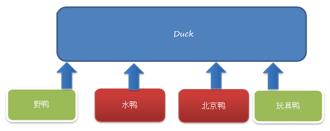
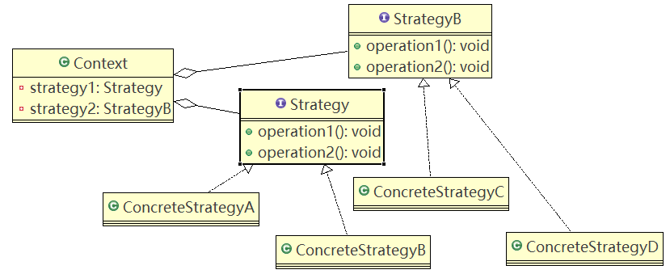
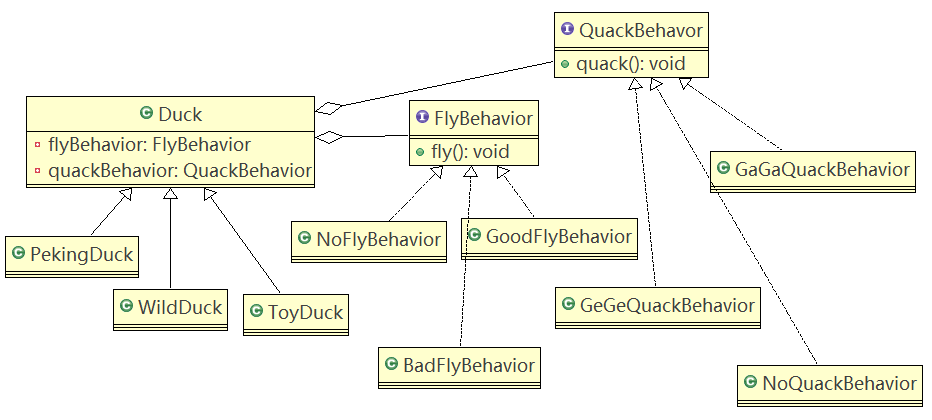

# 策略模式

## 问题引入

**鸭子项目：**

1. 有各种鸭子（如：野鸭、北京鸭、水鸭等，鸭子有各种行为，如：叫、飞行等）
2. 显示鸭子信息

### 传统方案

#### 类图



#### 代码实现

Duck.java

```java
public abstract class Duck {

	public Duck() {
	
	}

	public abstract void display();//显示鸭子信息
	
	public void quack() {
		System.out.println("鸭子嘎嘎叫~~");
	}
	
	public void swim() {
		System.out.println("鸭子会游泳~~");
	}
	
	public void fly() {
		System.out.println("鸭子会飞翔~~~");
	}
	
}
```

PekingDuck.java

```java
public class PekingDuck extends Duck {

	@Override
	public void display() {
		System.out.println("~~北京鸭~~~");
	}
	
	//因为北京鸭不能飞翔，因此需要重写fly
	@Override
	public void fly() {
		System.out.println("北京鸭不能飞翔");
	}

}
```

ToyDuck.java

```java
public class ToyDuck extends Duck{

	@Override
	public void display() {
		System.out.println("玩具鸭");
	}

	//需要重写父类的所有方法
	
	public void quack() {
		System.out.println("玩具鸭不能叫~~");
	}
	
	public void swim() {
		System.out.println("玩具鸭不会游泳~~");
	}
	
	public void fly() {
		System.out.println("玩具鸭不会飞翔~~~");
	}
}
```

WildDuck.java

```java
public class WildDuck extends Duck {

	@Override
	public void display() {
		System.out.println(" 这是野鸭 ");
	}

}
```

#### 传统方式的问题分析和解决方案

1. 其它鸭子，都继承了Duck类，所以fly让所有子类都会飞了，这是不正确的。
2. 如1所说的问题，其实是继承带来的问题：对类的局部改动，尤其超类的局部改动，会影响其它部分。会有溢出效应。
3. 改进1问题，可以通过覆盖fly方法解决→覆盖解决
4. 但是有一个玩具鸭子ToyDuck，就需要ToyDuck去覆盖Duck的所有实现的方法。

## 策略模式基本介绍

1. 策略模式（Strategy Pattern）中，定义**算法族（策略组）**，分别封装起来，让它们之间可以互相替换，此模式让**算法的变化独立于使用算法的客户**。
2. 这算法体现了几个设计原则，第一、把变化的代码从不变的代码中分离出来；第二、针对接口编程而不是具体的类（定义了策略接口）；第三、多用组合/聚合，少用继承（客户通过组合方式使用策略）。

### 原理类图

#### 类图



#### 说明

客户context有成员变量strategy或者其它的策略接口，至于需要使用到那个策略，可以在构造器中指定。

### 应用实例

#### 思路分析和类图

策略模式：分别封装行为接口，实现算法族，超类里放行为接口对象，在子类里具体设定行为对象。原则就是：分离变化部分，封装接口，基于接口编程各种功能。此模式让行为独立于算法的使用者。



#### 代码实现

Client.java

```java
public class Client {

	public static void main(String[] args) {
		WildDuck wildDuck = new WildDuck();
		wildDuck.fly();//
		
		ToyDuck toyDuck = new ToyDuck();
		toyDuck.fly();
		
		PekingDuck pekingDuck = new PekingDuck();
		pekingDuck.fly();
		
		//动态改变某个对象的行为, 北京鸭 不能飞
		pekingDuck.setFlyBehavior(new NoFlyBehavior());
		System.out.println("北京鸭的实际飞翔能力");
		pekingDuck.fly();
	}

}
```

FlyBehavior.java

```java
public interface FlyBehavior {
	
	void fly(); // 子类具体实现
}
```

BadFlyBehavior.java

```java
public class BadFlyBehavior implements FlyBehavior {

	@Override
	public void fly() {
		System.out.println(" 飞翔技术一般 ");
	}

}
```

GoodFlyBehavior.java

```java
public class GoodFlyBehavior implements FlyBehavior {

	@Override
	public void fly() {
		System.out.println(" 飞翔技术高超 ~~~");
	}

}
```

NoFlyBehavior.java

```java
public class NoFlyBehavior implements FlyBehavior{

	@Override
	public void fly() {
		System.out.println(" 不会飞翔  ");
	}

}
```

QuackBehavior.java

```java
public interface QuackBehavior {
	void quack();//子类实现
}
```

Duck.java

```java
public abstract class Duck {

	//属性, 策略接口
	FlyBehavior flyBehavior;
	//其它属性<->策略接口
	QuackBehavior quackBehavior;
	
	public Duck() {
	
	}

	public abstract void display();//显示鸭子信息
	
	public void quack() {
		System.out.println("鸭子嘎嘎叫~~");
	}
	
	public void swim() {
		System.out.println("鸭子会游泳~~");
	}
	
	public void fly() {
		
		//改进
		if(flyBehavior != null) {
			flyBehavior.fly();
		}
	}

	public void setFlyBehavior(FlyBehavior flyBehavior) {
		this.flyBehavior = flyBehavior;
	}
	
	
	public void setQuackBehavior(QuackBehavior quackBehavior) {
		this.quackBehavior = quackBehavior;
	}
	
}
```

PekingDuck.java

```java
public class PekingDuck extends Duck {

	//假如北京鸭可以飞翔，但是飞翔技术一般
	public PekingDuck() {
		flyBehavior = new BadFlyBehavior();
	}
	
	@Override
	public void display() {
		System.out.println("~~北京鸭~~~");
	}

}
```

ToyDuck.java

```java
public class ToyDuck extends Duck{

	public ToyDuck() {
		flyBehavior = new NoFlyBehavior();
	}
	
	@Override
	public void display() {
		System.out.println("玩具鸭");
	}

	//需要重写父类的所有方法
	public void quack() {
		System.out.println("玩具鸭不能叫~~");
	}
	
	public void swim() {
		System.out.println("玩具鸭不会游泳~~");
	}
		
}
```

WildDuck.java

```java
public class WildDuck extends Duck {

	//构造器，传入FlyBehavor 的对象
	public  WildDuck() {
		flyBehavior = new GoodFlyBehavior();
	}
	
	@Override
	public void display() {
		System.out.println(" 这是野鸭 ");
	}

}
```

## JDK中使用策略模式的源码分析

JDK的Arrays的Comparator就使用了策略模式

```java
package java.util;

import java.io.Serializable;
import java.util.function.Function;
import java.util.function.ToIntFunction;
import java.util.function.ToLongFunction;
import java.util.function.ToDoubleFunction;
import java.util.Comparators;

/**
 * A comparison function, which imposes a <i>total ordering</i> on some
 * collection of objects.  Comparators can be passed to a sort method (such
 * as {@link Collections#sort(List,Comparator) Collections.sort} or {@link
 * Arrays#sort(Object[],Comparator) Arrays.sort}) to allow precise control
 * over the sort order.  Comparators can also be used to control the order of
 * certain data structures (such as {@link SortedSet sorted sets} or {@link
 * SortedMap sorted maps}), or to provide an ordering for collections of
 * objects that don't have a {@link Comparable natural ordering}.<p>
 *
 * The ordering imposed by a comparator <tt>c</tt> on a set of elements
 * <tt>S</tt> is said to be <i>consistent with equals</i> if and only if
 * <tt>c.compare(e1, e2)==0</tt> has the same boolean value as
 * <tt>e1.equals(e2)</tt> for every <tt>e1</tt> and <tt>e2</tt> in
 * <tt>S</tt>.<p>
 *
 * Caution should be exercised when using a comparator capable of imposing an
 * ordering inconsistent with equals to order a sorted set (or sorted map).
 * Suppose a sorted set (or sorted map) with an explicit comparator <tt>c</tt>
 * is used with elements (or keys) drawn from a set <tt>S</tt>.  If the
 * ordering imposed by <tt>c</tt> on <tt>S</tt> is inconsistent with equals,
 * the sorted set (or sorted map) will behave "strangely."  In particular the
 * sorted set (or sorted map) will violate the general contract for set (or
 * map), which is defined in terms of <tt>equals</tt>.<p>
 *
 * For example, suppose one adds two elements {@code a} and {@code b} such that
 * {@code (a.equals(b) && c.compare(a, b) != 0)}
 * to an empty {@code TreeSet} with comparator {@code c}.
 * The second {@code add} operation will return
 * true (and the size of the tree set will increase) because {@code a} and
 * {@code b} are not equivalent from the tree set's perspective, even though
 * this is contrary to the specification of the
 * {@link Set#add Set.add} method.<p>
 *
 * Note: It is generally a good idea for comparators to also implement
 * <tt>java.io.Serializable</tt>, as they may be used as ordering methods in
 * serializable data structures (like {@link TreeSet}, {@link TreeMap}).  In
 * order for the data structure to serialize successfully, the comparator (if
 * provided) must implement <tt>Serializable</tt>.<p>
 *
 * For the mathematically inclined, the <i>relation</i> that defines the
 * <i>imposed ordering</i> that a given comparator <tt>c</tt> imposes on a
 * given set of objects <tt>S</tt> is:<pre>
 *       {(x, y) such that c.compare(x, y) &lt;= 0}.
 * </pre> The <i>quotient</i> for this total order is:<pre>
 *       {(x, y) such that c.compare(x, y) == 0}.
 * </pre>
 *
 * It follows immediately from the contract for <tt>compare</tt> that the
 * quotient is an <i>equivalence relation</i> on <tt>S</tt>, and that the
 * imposed ordering is a <i>total order</i> on <tt>S</tt>.  When we say that
 * the ordering imposed by <tt>c</tt> on <tt>S</tt> is <i>consistent with
 * equals</i>, we mean that the quotient for the ordering is the equivalence
 * relation defined by the objects' {@link Object#equals(Object)
 * equals(Object)} method(s):<pre>
 *     {(x, y) such that x.equals(y)}. </pre>
 *
 * <p>Unlike {@code Comparable}, a comparator may optionally permit
 * comparison of null arguments, while maintaining the requirements for
 * an equivalence relation.
 *
 * <p>This interface is a member of the
 * <a href="{@docRoot}/../technotes/guides/collections/index.html">
 * Java Collections Framework</a>.
 *
 * @param <T> the type of objects that may be compared by this comparator
 *
 * @author  Josh Bloch
 * @author  Neal Gafter
 * @see Comparable
 * @see java.io.Serializable
 * @since 1.2
 */
@FunctionalInterface
public interface Comparator<T> {
    /**
     * Compares its two arguments for order.  Returns a negative integer,
     * zero, or a positive integer as the first argument is less than, equal
     * to, or greater than the second.<p>
     *
     * In the foregoing description, the notation
     * <tt>sgn(</tt><i>expression</i><tt>)</tt> designates the mathematical
     * <i>signum</i> function, which is defined to return one of <tt>-1</tt>,
     * <tt>0</tt>, or <tt>1</tt> according to whether the value of
     * <i>expression</i> is negative, zero or positive.<p>
     *
     * The implementor must ensure that <tt>sgn(compare(x, y)) ==
     * -sgn(compare(y, x))</tt> for all <tt>x</tt> and <tt>y</tt>.  (This
     * implies that <tt>compare(x, y)</tt> must throw an exception if and only
     * if <tt>compare(y, x)</tt> throws an exception.)<p>
     *
     * The implementor must also ensure that the relation is transitive:
     * <tt>((compare(x, y)&gt;0) &amp;&amp; (compare(y, z)&gt;0))</tt> implies
     * <tt>compare(x, z)&gt;0</tt>.<p>
     *
     * Finally, the implementor must ensure that <tt>compare(x, y)==0</tt>
     * implies that <tt>sgn(compare(x, z))==sgn(compare(y, z))</tt> for all
     * <tt>z</tt>.<p>
     *
     * It is generally the case, but <i>not</i> strictly required that
     * <tt>(compare(x, y)==0) == (x.equals(y))</tt>.  Generally speaking,
     * any comparator that violates this condition should clearly indicate
     * this fact.  The recommended language is "Note: this comparator
     * imposes orderings that are inconsistent with equals."
     *
     * @param o1 the first object to be compared.
     * @param o2 the second object to be compared.
     * @return a negative integer, zero, or a positive integer as the
     *         first argument is less than, equal to, or greater than the
     *         second.
     * @throws NullPointerException if an argument is null and this
     *         comparator does not permit null arguments
     * @throws ClassCastException if the arguments' types prevent them from
     *         being compared by this comparator.
     */
    int compare(T o1, T o2);

    /**
     * Indicates whether some other object is &quot;equal to&quot; this
     * comparator.  This method must obey the general contract of
     * {@link Object#equals(Object)}.  Additionally, this method can return
     * <tt>true</tt> <i>only</i> if the specified object is also a comparator
     * and it imposes the same ordering as this comparator.  Thus,
     * <code>comp1.equals(comp2)</code> implies that <tt>sgn(comp1.compare(o1,
     * o2))==sgn(comp2.compare(o1, o2))</tt> for every object reference
     * <tt>o1</tt> and <tt>o2</tt>.<p>
     *
     * Note that it is <i>always</i> safe <i>not</i> to override
     * <tt>Object.equals(Object)</tt>.  However, overriding this method may,
     * in some cases, improve performance by allowing programs to determine
     * that two distinct comparators impose the same order.
     *
     * @param   obj   the reference object with which to compare.
     * @return  <code>true</code> only if the specified object is also
     *          a comparator and it imposes the same ordering as this
     *          comparator.
     * @see Object#equals(Object)
     * @see Object#hashCode()
     */
    boolean equals(Object obj);

    /**
     * Returns a comparator that imposes the reverse ordering of this
     * comparator.
     *
     * @return a comparator that imposes the reverse ordering of this
     *         comparator.
     * @since 1.8
     */
    default Comparator<T> reversed() {
        return Collections.reverseOrder(this);
    }

    /**
     * Returns a lexicographic-order comparator with another comparator.
     * If this {@code Comparator} considers two elements equal, i.e.
     * {@code compare(a, b) == 0}, {@code other} is used to determine the order.
     *
     * <p>The returned comparator is serializable if the specified comparator
     * is also serializable.
     *
     * @apiNote
     * For example, to sort a collection of {@code String} based on the length
     * and then case-insensitive natural ordering, the comparator can be
     * composed using following code,
     *
     * <pre>{@code
     *     Comparator<String> cmp = Comparator.comparingInt(String::length)
     *             .thenComparing(String.CASE_INSENSITIVE_ORDER);
     * }</pre>
     *
     * @param  other the other comparator to be used when this comparator
     *         compares two objects that are equal.
     * @return a lexicographic-order comparator composed of this and then the
     *         other comparator
     * @throws NullPointerException if the argument is null.
     * @since 1.8
     */
    default Comparator<T> thenComparing(Comparator<? super T> other) {
        Objects.requireNonNull(other);
        return (Comparator<T> & Serializable) (c1, c2) -> {
            int res = compare(c1, c2);
            return (res != 0) ? res : other.compare(c1, c2);
        };
    }

    /**
     * Returns a lexicographic-order comparator with a function that
     * extracts a key to be compared with the given {@code Comparator}.
     *
     * @implSpec This default implementation behaves as if {@code
     *           thenComparing(comparing(keyExtractor, cmp))}.
     *
     * @param  <U>  the type of the sort key
     * @param  keyExtractor the function used to extract the sort key
     * @param  keyComparator the {@code Comparator} used to compare the sort key
     * @return a lexicographic-order comparator composed of this comparator
     *         and then comparing on the key extracted by the keyExtractor function
     * @throws NullPointerException if either argument is null.
     * @see #comparing(Function, Comparator)
     * @see #thenComparing(Comparator)
     * @since 1.8
     */
    default <U> Comparator<T> thenComparing(
            Function<? super T, ? extends U> keyExtractor,
            Comparator<? super U> keyComparator)
    {
        return thenComparing(comparing(keyExtractor, keyComparator));
    }

    /**
     * Returns a lexicographic-order comparator with a function that
     * extracts a {@code Comparable} sort key.
     *
     * @implSpec This default implementation behaves as if {@code
     *           thenComparing(comparing(keyExtractor))}.
     *
     * @param  <U>  the type of the {@link Comparable} sort key
     * @param  keyExtractor the function used to extract the {@link
     *         Comparable} sort key
     * @return a lexicographic-order comparator composed of this and then the
     *         {@link Comparable} sort key.
     * @throws NullPointerException if the argument is null.
     * @see #comparing(Function)
     * @see #thenComparing(Comparator)
     * @since 1.8
     */
    default <U extends Comparable<? super U>> Comparator<T> thenComparing(
            Function<? super T, ? extends U> keyExtractor)
    {
        return thenComparing(comparing(keyExtractor));
    }

    /**
     * Returns a lexicographic-order comparator with a function that
     * extracts a {@code int} sort key.
     *
     * @implSpec This default implementation behaves as if {@code
     *           thenComparing(comparingInt(keyExtractor))}.
     *
     * @param  keyExtractor the function used to extract the integer sort key
     * @return a lexicographic-order comparator composed of this and then the
     *         {@code int} sort key
     * @throws NullPointerException if the argument is null.
     * @see #comparingInt(ToIntFunction)
     * @see #thenComparing(Comparator)
     * @since 1.8
     */
    default Comparator<T> thenComparingInt(ToIntFunction<? super T> keyExtractor) {
        return thenComparing(comparingInt(keyExtractor));
    }

    /**
     * Returns a lexicographic-order comparator with a function that
     * extracts a {@code long} sort key.
     *
     * @implSpec This default implementation behaves as if {@code
     *           thenComparing(comparingLong(keyExtractor))}.
     *
     * @param  keyExtractor the function used to extract the long sort key
     * @return a lexicographic-order comparator composed of this and then the
     *         {@code long} sort key
     * @throws NullPointerException if the argument is null.
     * @see #comparingLong(ToLongFunction)
     * @see #thenComparing(Comparator)
     * @since 1.8
     */
    default Comparator<T> thenComparingLong(ToLongFunction<? super T> keyExtractor) {
        return thenComparing(comparingLong(keyExtractor));
    }

    /**
     * Returns a lexicographic-order comparator with a function that
     * extracts a {@code double} sort key.
     *
     * @implSpec This default implementation behaves as if {@code
     *           thenComparing(comparingDouble(keyExtractor))}.
     *
     * @param  keyExtractor the function used to extract the double sort key
     * @return a lexicographic-order comparator composed of this and then the
     *         {@code double} sort key
     * @throws NullPointerException if the argument is null.
     * @see #comparingDouble(ToDoubleFunction)
     * @see #thenComparing(Comparator)
     * @since 1.8
     */
    default Comparator<T> thenComparingDouble(ToDoubleFunction<? super T> keyExtractor) {
        return thenComparing(comparingDouble(keyExtractor));
    }

    /**
     * Returns a comparator that imposes the reverse of the <em>natural
     * ordering</em>.
     *
     * <p>The returned comparator is serializable and throws {@link
     * NullPointerException} when comparing {@code null}.
     *
     * @param  <T> the {@link Comparable} type of element to be compared
     * @return a comparator that imposes the reverse of the <i>natural
     *         ordering</i> on {@code Comparable} objects.
     * @see Comparable
     * @since 1.8
     */
    public static <T extends Comparable<? super T>> Comparator<T> reverseOrder() {
        return Collections.reverseOrder();
    }

    /**
     * Returns a comparator that compares {@link Comparable} objects in natural
     * order.
     *
     * <p>The returned comparator is serializable and throws {@link
     * NullPointerException} when comparing {@code null}.
     *
     * @param  <T> the {@link Comparable} type of element to be compared
     * @return a comparator that imposes the <i>natural ordering</i> on {@code
     *         Comparable} objects.
     * @see Comparable
     * @since 1.8
     */
    @SuppressWarnings("unchecked")
    public static <T extends Comparable<? super T>> Comparator<T> naturalOrder() {
        return (Comparator<T>) Comparators.NaturalOrderComparator.INSTANCE;
    }

    /**
     * Returns a null-friendly comparator that considers {@code null} to be
     * less than non-null. When both are {@code null}, they are considered
     * equal. If both are non-null, the specified {@code Comparator} is used
     * to determine the order. If the specified comparator is {@code null},
     * then the returned comparator considers all non-null values to be equal.
     *
     * <p>The returned comparator is serializable if the specified comparator
     * is serializable.
     *
     * @param  <T> the type of the elements to be compared
     * @param  comparator a {@code Comparator} for comparing non-null values
     * @return a comparator that considers {@code null} to be less than
     *         non-null, and compares non-null objects with the supplied
     *         {@code Comparator}.
     * @since 1.8
     */
    public static <T> Comparator<T> nullsFirst(Comparator<? super T> comparator) {
        return new Comparators.NullComparator<>(true, comparator);
    }

    /**
     * Returns a null-friendly comparator that considers {@code null} to be
     * greater than non-null. When both are {@code null}, they are considered
     * equal. If both are non-null, the specified {@code Comparator} is used
     * to determine the order. If the specified comparator is {@code null},
     * then the returned comparator considers all non-null values to be equal.
     *
     * <p>The returned comparator is serializable if the specified comparator
     * is serializable.
     *
     * @param  <T> the type of the elements to be compared
     * @param  comparator a {@code Comparator} for comparing non-null values
     * @return a comparator that considers {@code null} to be greater than
     *         non-null, and compares non-null objects with the supplied
     *         {@code Comparator}.
     * @since 1.8
     */
    public static <T> Comparator<T> nullsLast(Comparator<? super T> comparator) {
        return new Comparators.NullComparator<>(false, comparator);
    }

    /**
     * Accepts a function that extracts a sort key from a type {@code T}, and
     * returns a {@code Comparator<T>} that compares by that sort key using
     * the specified {@link Comparator}.
      *
     * <p>The returned comparator is serializable if the specified function
     * and comparator are both serializable.
     *
     * @apiNote
     * For example, to obtain a {@code Comparator} that compares {@code
     * Person} objects by their last name ignoring case differences,
     *
     * <pre>{@code
     *     Comparator<Person> cmp = Comparator.comparing(
     *             Person::getLastName,
     *             String.CASE_INSENSITIVE_ORDER);
     * }</pre>
     *
     * @param  <T> the type of element to be compared
     * @param  <U> the type of the sort key
     * @param  keyExtractor the function used to extract the sort key
     * @param  keyComparator the {@code Comparator} used to compare the sort key
     * @return a comparator that compares by an extracted key using the
     *         specified {@code Comparator}
     * @throws NullPointerException if either argument is null
     * @since 1.8
     */
    public static <T, U> Comparator<T> comparing(
            Function<? super T, ? extends U> keyExtractor,
            Comparator<? super U> keyComparator)
    {
        Objects.requireNonNull(keyExtractor);
        Objects.requireNonNull(keyComparator);
        return (Comparator<T> & Serializable)
            (c1, c2) -> keyComparator.compare(keyExtractor.apply(c1),
                                              keyExtractor.apply(c2));
    }

    /**
     * Accepts a function that extracts a {@link java.lang.Comparable
     * Comparable} sort key from a type {@code T}, and returns a {@code
     * Comparator<T>} that compares by that sort key.
     *
     * <p>The returned comparator is serializable if the specified function
     * is also serializable.
     *
     * @apiNote
     * For example, to obtain a {@code Comparator} that compares {@code
     * Person} objects by their last name,
     *
     * <pre>{@code
     *     Comparator<Person> byLastName = Comparator.comparing(Person::getLastName);
     * }</pre>
     *
     * @param  <T> the type of element to be compared
     * @param  <U> the type of the {@code Comparable} sort key
     * @param  keyExtractor the function used to extract the {@link
     *         Comparable} sort key
     * @return a comparator that compares by an extracted key
     * @throws NullPointerException if the argument is null
     * @since 1.8
     */
    public static <T, U extends Comparable<? super U>> Comparator<T> comparing(
            Function<? super T, ? extends U> keyExtractor)
    {
        Objects.requireNonNull(keyExtractor);
        return (Comparator<T> & Serializable)
            (c1, c2) -> keyExtractor.apply(c1).compareTo(keyExtractor.apply(c2));
    }

    /**
     * Accepts a function that extracts an {@code int} sort key from a type
     * {@code T}, and returns a {@code Comparator<T>} that compares by that
     * sort key.
     *
     * <p>The returned comparator is serializable if the specified function
     * is also serializable.
     *
     * @param  <T> the type of element to be compared
     * @param  keyExtractor the function used to extract the integer sort key
     * @return a comparator that compares by an extracted key
     * @see #comparing(Function)
     * @throws NullPointerException if the argument is null
     * @since 1.8
     */
    public static <T> Comparator<T> comparingInt(ToIntFunction<? super T> keyExtractor) {
        Objects.requireNonNull(keyExtractor);
        return (Comparator<T> & Serializable)
            (c1, c2) -> Integer.compare(keyExtractor.applyAsInt(c1), keyExtractor.applyAsInt(c2));
    }

    /**
     * Accepts a function that extracts a {@code long} sort key from a type
     * {@code T}, and returns a {@code Comparator<T>} that compares by that
     * sort key.
     *
     * <p>The returned comparator is serializable if the specified function is
     * also serializable.
     *
     * @param  <T> the type of element to be compared
     * @param  keyExtractor the function used to extract the long sort key
     * @return a comparator that compares by an extracted key
     * @see #comparing(Function)
     * @throws NullPointerException if the argument is null
     * @since 1.8
     */
    public static <T> Comparator<T> comparingLong(ToLongFunction<? super T> keyExtractor) {
        Objects.requireNonNull(keyExtractor);
        return (Comparator<T> & Serializable)
            (c1, c2) -> Long.compare(keyExtractor.applyAsLong(c1), keyExtractor.applyAsLong(c2));
    }

    /**
     * Accepts a function that extracts a {@code double} sort key from a type
     * {@code T}, and returns a {@code Comparator<T>} that compares by that
     * sort key.
     *
     * <p>The returned comparator is serializable if the specified function
     * is also serializable.
     *
     * @param  <T> the type of element to be compared
     * @param  keyExtractor the function used to extract the double sort key
     * @return a comparator that compares by an extracted key
     * @see #comparing(Function)
     * @throws NullPointerException if the argument is null
     * @since 1.8
     */
    public static<T> Comparator<T> comparingDouble(ToDoubleFunction<? super T> keyExtractor) {
        Objects.requireNonNull(keyExtractor);
        return (Comparator<T> & Serializable)
            (c1, c2) -> Double.compare(keyExtractor.applyAsDouble(c1), keyExtractor.applyAsDouble(c2));
    }
}
```

```java
public class Arrays {
    ...
    public static <T> void sort(T[] a, Comparator<? super T> c) {
            if (c == null) {
                sort(a);
            } else {
                if (LegacyMergeSort.userRequested)
                    legacyMergeSort(a, c);
                else
                    TimSort.sort(a, 0, a.length, c, null, 0, 0);
            }
        }
    ...
}
```

```java
import java.util.Arrays;
import java.util.Comparator;


public class Strategy {

	public static void main(String[] args) {
		//数组
		Integer[] data = { 9, 1, 2, 8, 4, 3 };
		// 实现降序排序，返回-1放左边，1放右边，0保持不变
		
		// 说明
		// 1. 实现了 Comparator 接口（策略接口） , 匿名类 对象 new Comparator<Integer>(){..}
		// 2. 对象 new Comparator<Integer>(){..} 就是实现了 策略接口 的对象
		// 3. public int compare(Integer o1, Integer o2){} 指定具体的处理方式
		Comparator<Integer> comparator = new Comparator<Integer>() {
			public int compare(Integer o1, Integer o2) {
				if (o1 > o2) {
					return -1;
				} else {
					return 1;
				}
			};
		};
		
		// 说明
		/*
		 * public static <T> void sort(T[] a, Comparator<? super T> c) {
		        if (c == null) {
		            sort(a); //默认方法
		        } else { 
		            if (LegacyMergeSort.userRequested)
		                legacyMergeSort(a, c); //使用策略对象c
		            else
		            	// 使用策略对象c
		                TimSort.sort(a, 0, a.length, c, null, 0, 0);
		        }
		    }
		 */
		//方式1 
		Arrays.sort(data, comparator);
		
		System.out.println(Arrays.toString(data)); // 降序排序

		//方式2- 同时lambda 表达式实现 策略模式
		Integer[] data2 = { 19, 11, 12, 18, 14, 13 };
		
		Arrays.sort(data2, (var1, var2) -> {
			if(var1.compareTo(var2) > 0) {
				return -1;
			} else {
				return 1;
			}
		});
		
		System.out.println("data2=" + Arrays.toString(data2));
		
	}

}
```

## 注意事项和细节

1. 策略模式的关键是：分析项目中变化部分与不变部分
2. 核心思想是：多用组合/聚合，少用继承；用行为类组合，而不是行为的继承。更有弹性。
3. 体现了“对修改关闭，对扩展开放”原则，客户端增加行为不用修改原有代码，只要添加一种策略（或者行为）即可，避免了使用多重转移语句（if...else if...else）
4. 提供了可以替换继承关系的办法：策略模式将算法封装在独立的Strategy类中使得你可以独立于其Context改变它，使它易于切换、易于理解、易于扩展。
5. 注意：每添加一个策略就要增加一个类，当策略过多时会导致类的数目庞大。

