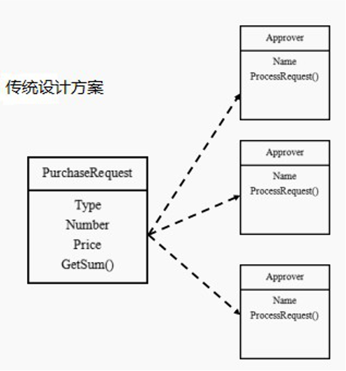
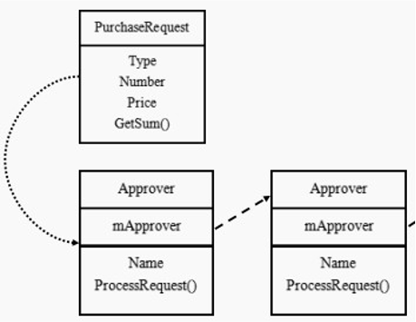
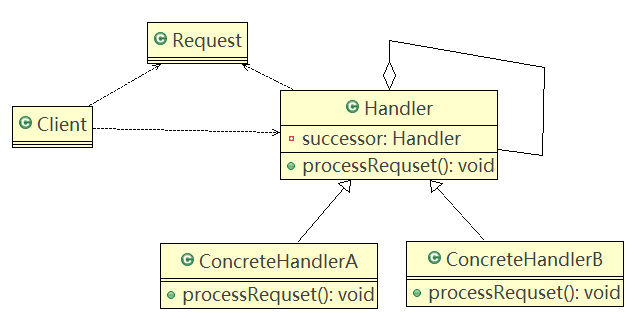
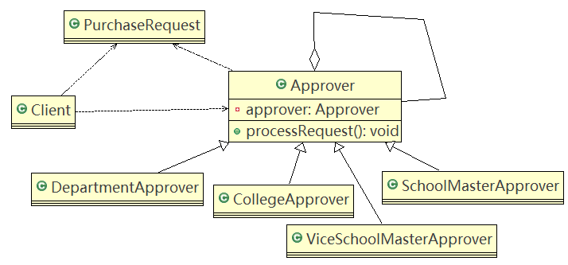

# 职责链模式

## 问题引入

#### 问题

**学校OA系统的采购审批项目：**

1. 采购员采购教学器材
2. 如果金额小于等于5000, 由教学主任审批（0<=x<=5000）
3. 如果金额 小于等于10000, 由院长审批 (5000<x<=10000)
4. 如果金额小于等于30000, 由副校长审批 (10000<x<=30000)
5. 如果金额超过30000以上，有校长审批( 30000<x)

#### 传统方案

##### 类图



##### 问题分析

1. 传统方案是：接收到一个采购请求后，根据采购金额来调用对应的Approver（审批人）完成审批。
2. 传统方式的问题分析：客户端会使用到分支判断（如：switch）来对不同的采购请求处理，会存在如下问题：①如果各个级别的人员审批金额发生变化，在客户端的也需要变化。②客户端必须明确的知道有多少个审批级别和访问。
3. 这样对一个采购请求进行处理和Approver（审批人）就存在强耦合关系，不利于代码的扩展和维护。

## 职责链模式基本介绍

1. 职责链模式（Chain of Responsibility Pattern），又叫责任链模式，为请求创建了一个接收者对象的链（简单示意图）。这种模式对请求的发送者和接收者进行解耦。

   

2. 职责链模式通常每个接收者都包含对另一个接收者的引用。如果一个对象不能处理该请求，那么它会把相同的请求传给下一个接收者，以此类推。

3. 这种类型的设计模式属于行为型模式。

### 原理类图

#### 类图



#### 说明

1. **Handler**：抽象的处理者，定义了一个处理请求的接口，同时含有另外的Handler
2. **ConcreteHandlerA，B**：是具体的处理者，处理它自己负责的请求，可以访问它的后继者（即下一个处理者），如果可以处理当前请求，则处理，否则就将该请求交给后继者去处理，从而形成一个职责链。
3. **Request**：含有很多属性，表示一个请求。

### 应用实例

#### 类图



#### 代码实现

Client.java

```java
public class Client {

	public static void main(String[] args) {
		//创建一个请求
		PurchaseRequest purchaseRequest = new PurchaseRequest(1, 31000, 1);
		
		//创建相关的审批人
		DepartmentApprover departmentApprover = new DepartmentApprover("张主任");
		CollegeApprover collegeApprover = new CollegeApprover("李院长");
		ViceSchoolMasterApprover viceSchoolMasterApprover = new ViceSchoolMasterApprover("王副校");
		SchoolMasterApprover schoolMasterApprover = new SchoolMasterApprover("佟校长");
	
		//需要将各个审批级别的下一个设置好 (处理人构成环形: )
		departmentApprover.setApprover(collegeApprover);
		collegeApprover.setApprover(viceSchoolMasterApprover);
		viceSchoolMasterApprover.setApprover(schoolMasterApprover);
		schoolMasterApprover.setApprover(departmentApprover);
		
		departmentApprover.processRequest(purchaseRequest);
		viceSchoolMasterApprover.processRequest(purchaseRequest);
	}

}
```

Approver.java

```java
public abstract class Approver {

	Approver approver;  //下一个处理者
	String name; // 名字
	
	public Approver(String name) {
		this.name = name;
	}

	//下一个处理者
	public void setApprover(Approver approver) {
		this.approver = approver;
	}
	
	//处理审批请求的方法，得到一个请求, 处理是子类完成，因此该方法做成抽象
	public abstract void processRequest(PurchaseRequest purchaseRequest);
	
}
```

CollegeApprover.java

```java
public class CollegeApprover extends Approver {

	public CollegeApprover(String name) {
		super(name);
	}
	
	@Override
	public void processRequest(PurchaseRequest purchaseRequest) {
		if(purchaseRequest.getPrice() < 5000 && purchaseRequest.getPrice() <= 10000) {
			System.out.println(" 请求编号 id= " + purchaseRequest.getId() + " 被 " + this.name + " 处理");
		}else {
			approver.processRequest(purchaseRequest);
		}
	}
}
```

DepartmentApprover.java

```java
public class DepartmentApprover extends Approver {

	public DepartmentApprover(String name) {
		super(name);
	}
	
	@Override
	public void processRequest(PurchaseRequest purchaseRequest) {
		if(purchaseRequest.getPrice() <= 5000) {
			System.out.println(" 请求编号 id= " + purchaseRequest.getId() + " 被 " + this.name + " 处理");
		}else {
			approver.processRequest(purchaseRequest);
		}
	}

}
```

SchoolMasterApprover.java

```java
public class SchoolMasterApprover extends Approver {

	public SchoolMasterApprover(String name) {
		super(name);
	}
	
	@Override
	public void processRequest(PurchaseRequest purchaseRequest) {
		if(purchaseRequest.getPrice() > 30000) {
			System.out.println(" 请求编号 id= " + purchaseRequest.getId() + " 被 " + this.name + " 处理");
		}else {
			approver.processRequest(purchaseRequest);
		}
	}
}
```

ViceSchoolMasterApprover.java

```java
public class ViceSchoolMasterApprover extends Approver {

	public ViceSchoolMasterApprover(String name) {
		super(name);
	}
	
	@Override
	public void processRequest(PurchaseRequest purchaseRequest) {
		if(purchaseRequest.getPrice() < 10000 && purchaseRequest.getPrice() <= 30000) {
			System.out.println(" 请求编号 id= " + purchaseRequest.getId() + " 被 " + this.name + " 处理");
		}else {
			approver.processRequest(purchaseRequest);
		}
	}
}
```

PurchaseRequest.java

```java
//请求类
public class PurchaseRequest {

	private int type = 0; //请求类型
	private float price = 0.0f; //请求金额
	private int id = 0;
	//构造器
	public PurchaseRequest(int type, float price, int id) {
		this.type = type;
		this.price = price;
		this.id = id;
	}
	public int getType() {
		return type;
	}
	public float getPrice() {
		return price;
	}
	public int getId() {
		return id;
	}
}
```

## SpringMVC框架应用职责链模式的源码分析

SpringMVC-HandlerExecutionChain类就使用到职责链模式

```java
public class ResponsibilityChain {

	public static void main(String[] args) {
		
		// DispatcherServlet 
		
		//说明
		/*
		 * 
		 *  protected void doDispatch(HttpServletRequest request, HttpServletResponse response) throws Exception {
		 *   HandlerExecutionChain mappedHandler = null; 
		 *   mappedHandler = getHandler(processedRequest);//获取到HandlerExecutionChain对象
		 *    //在 mappedHandler.applyPreHandle 内部 得到啦 HandlerInterceptor interceptor
		 *    //调用了拦截器的  interceptor.preHandle
		 *   if (!mappedHandler.applyPreHandle(processedRequest, response)) {
					return;
				}
				
			  //说明：mappedHandler.applyPostHandle 方法内部获取到拦截器，并调用 
			  //拦截器的  interceptor.postHandle(request, response, this.handler, mv);
			 mappedHandler.applyPostHandle(processedRequest, response, mv);
		 *  }
		 *  
		 *  
		 *  //说明：在  mappedHandler.applyPreHandle内部中，
		 *  还调用了  triggerAfterCompletion 方法，该方法中调用了  
		 *  HandlerInterceptor interceptor = getInterceptors()[i];
			try {
				interceptor.afterCompletion(request, response, this.handler, ex);
			}
			catch (Throwable ex2) {
				logger.error("HandlerInterceptor.afterCompletion threw exception", ex2);
			}
		 */
	
	}

}
```

```java
public class DispatcherServlet extends FrameworkServlet {
    ...
protected void doDispatch(HttpServletRequest request, HttpServletResponse response) throws Exception {
		HttpServletRequest processedRequest = request;
		HandlerExecutionChain mappedHandler = null;
		boolean multipartRequestParsed = false;

		WebAsyncManager asyncManager = WebAsyncUtils.getAsyncManager(request);

		try {
			ModelAndView mv = null;
			Exception dispatchException = null;

			try {
				processedRequest = checkMultipart(request);
				multipartRequestParsed = processedRequest != request;

				// Determine handler for the current request.
				mappedHandler = getHandler(processedRequest);
				if (mappedHandler == null || mappedHandler.getHandler() == null) {
					noHandlerFound(processedRequest, response);
					return;
				}

				// Determine handler adapter for the current request.
				HandlerAdapter ha = getHandlerAdapter(mappedHandler.getHandler());

				// Process last-modified header, if supported by the handler.
				String method = request.getMethod();
				boolean isGet = "GET".equals(method);
				if (isGet || "HEAD".equals(method)) {
					long lastModified = ha.getLastModified(request, mappedHandler.getHandler());
					if (logger.isDebugEnabled()) {
						String requestUri = urlPathHelper.getRequestUri(request);
						logger.debug("Last-Modified value for [" + requestUri + "] is: " + lastModified);
					}
					if (new ServletWebRequest(request, response).checkNotModified(lastModified) && isGet) {
						return;
					}
				}

				if (!mappedHandler.applyPreHandle(processedRequest, response)) {
					return;
				}

				try {
					// Actually invoke the handler.
					mv = ha.handle(processedRequest, response, mappedHandler.getHandler());
				}
				finally {
					if (asyncManager.isConcurrentHandlingStarted()) {
						return;
					}
				}

				applyDefaultViewName(request, mv);
				mappedHandler.applyPostHandle(processedRequest, response, mv);
			}
			catch (Exception ex) {
				dispatchException = ex;
			}
			processDispatchResult(processedRequest, response, mappedHandler, mv, dispatchException);
		}
		catch (Exception ex) {
			triggerAfterCompletion(processedRequest, response, mappedHandler, ex);
		}
		catch (Error err) {
			triggerAfterCompletionWithError(processedRequest, response, mappedHandler, err);
		}
		finally {
			if (asyncManager.isConcurrentHandlingStarted()) {
				// Instead of postHandle and afterCompletion
				mappedHandler.applyAfterConcurrentHandlingStarted(processedRequest, response);
				return;
			}
			// Clean up any resources used by a multipart request.
			if (multipartRequestParsed) {
				cleanupMultipart(processedRequest);
			}
		}
	}
    ...
}
```

```java
package org.springframework.web.servlet;

import java.util.ArrayList;
import java.util.Arrays;
import java.util.List;

import javax.servlet.http.HttpServletRequest;
import javax.servlet.http.HttpServletResponse;

import org.apache.commons.logging.Log;
import org.apache.commons.logging.LogFactory;
import org.springframework.util.CollectionUtils;

/**
 * Handler execution chain, consisting of handler object and any handler interceptors.
 * Returned by HandlerMapping's {@link HandlerMapping#getHandler} method.
 *
 * @author Juergen Hoeller
 * @since 20.06.2003
 * @see HandlerInterceptor
 */
public class HandlerExecutionChain {

	private static final Log logger = LogFactory.getLog(HandlerExecutionChain.class);

	private final Object handler;

	private HandlerInterceptor[] interceptors;

	private List<HandlerInterceptor> interceptorList;

	private int interceptorIndex = -1;


	/**
	 * Create a new HandlerExecutionChain.
	 * @param handler the handler object to execute
	 */
	public HandlerExecutionChain(Object handler) {
		this(handler, null);
	}

	/**
	 * Create a new HandlerExecutionChain.
	 * @param handler the handler object to execute
	 * @param interceptors the array of interceptors to apply
	 * (in the given order) before the handler itself executes
	 */
	public HandlerExecutionChain(Object handler, HandlerInterceptor[] interceptors) {
		if (handler instanceof HandlerExecutionChain) {
			HandlerExecutionChain originalChain = (HandlerExecutionChain) handler;
			this.handler = originalChain.getHandler();
			this.interceptorList = new ArrayList<HandlerInterceptor>();
			CollectionUtils.mergeArrayIntoCollection(originalChain.getInterceptors(), this.interceptorList);
			CollectionUtils.mergeArrayIntoCollection(interceptors, this.interceptorList);
		}
		else {
			this.handler = handler;
			this.interceptors = interceptors;
		}
	}

	/**
	 * Return the handler object to execute.
	 * @return the handler object
	 */
	public Object getHandler() {
		return this.handler;
	}

	public void addInterceptor(HandlerInterceptor interceptor) {
		initInterceptorList();
		this.interceptorList.add(interceptor);
	}

	public void addInterceptors(HandlerInterceptor[] interceptors) {
		if (interceptors != null) {
			initInterceptorList();
			this.interceptorList.addAll(Arrays.asList(interceptors));
		}
	}

	private void initInterceptorList() {
		if (this.interceptorList == null) {
			this.interceptorList = new ArrayList<HandlerInterceptor>();
		}
		if (this.interceptors != null) {
			this.interceptorList.addAll(Arrays.asList(this.interceptors));
			this.interceptors = null;
		}
	}

	/**
	 * Return the array of interceptors to apply (in the given order).
	 * @return the array of HandlerInterceptors instances (may be {@code null})
	 */
	public HandlerInterceptor[] getInterceptors() {
		if (this.interceptors == null && this.interceptorList != null) {
			this.interceptors = this.interceptorList.toArray(new HandlerInterceptor[this.interceptorList.size()]);
		}
		return this.interceptors;
	}

	/**
	 * Apply preHandle methods of registered interceptors.
	 * @return {@code true} if the execution chain should proceed with the
	 * next interceptor or the handler itself. Else, DispatcherServlet assumes
	 * that this interceptor has already dealt with the response itself.
	 */
	boolean applyPreHandle(HttpServletRequest request, HttpServletResponse response) throws Exception {
		if (getInterceptors() != null) {
			for (int i = 0; i < getInterceptors().length; i++) {
				HandlerInterceptor interceptor = getInterceptors()[i];
				if (!interceptor.preHandle(request, response, this.handler)) {
					triggerAfterCompletion(request, response, null);
					return false;
				}
				this.interceptorIndex = i;
			}
		}
		return true;
	}

	/**
	 * Apply postHandle methods of registered interceptors.
	 */
	void applyPostHandle(HttpServletRequest request, HttpServletResponse response, ModelAndView mv) throws Exception {
		if (getInterceptors() == null) {
			return;
		}
		for (int i = getInterceptors().length - 1; i >= 0; i--) {
			HandlerInterceptor interceptor = getInterceptors()[i];
			interceptor.postHandle(request, response, this.handler, mv);
		}
	}

	/**
	 * Trigger afterCompletion callbacks on the mapped HandlerInterceptors.
	 * Will just invoke afterCompletion for all interceptors whose preHandle invocation
	 * has successfully completed and returned true.
	 */
	void triggerAfterCompletion(HttpServletRequest request, HttpServletResponse response, Exception ex)
			throws Exception {

		if (getInterceptors() == null) {
			return;
		}
		for (int i = this.interceptorIndex; i >= 0; i--) {
			HandlerInterceptor interceptor = getInterceptors()[i];
			try {
				interceptor.afterCompletion(request, response, this.handler, ex);
			}
			catch (Throwable ex2) {
				logger.error("HandlerInterceptor.afterCompletion threw exception", ex2);
			}
		}
	}

	/**
	 * Apply afterConcurrentHandlerStarted callback on mapped AsyncHandlerInterceptors.
	 */
	void applyAfterConcurrentHandlingStarted(HttpServletRequest request, HttpServletResponse response) {
		if (getInterceptors() == null) {
			return;
		}
		for (int i = getInterceptors().length - 1; i >= 0; i--) {
			if (interceptors[i] instanceof AsyncHandlerInterceptor) {
				try {
					AsyncHandlerInterceptor asyncInterceptor = (AsyncHandlerInterceptor) this.interceptors[i];
					asyncInterceptor.afterConcurrentHandlingStarted(request, response, this.handler);
				}
				catch (Throwable ex) {
					logger.error("Interceptor [" + interceptors[i] + "] failed in afterConcurrentHandlingStarted", ex);
				}
			}
		}
	}

	/**
	 * Delegates to the handler's {@code toString()}.
	 */
	@Override
	public String toString() {
		if (this.handler == null) {
			return "HandlerExecutionChain with no handler";
		}
		StringBuilder sb = new StringBuilder();
		sb.append("HandlerExecutionChain with handler [").append(this.handler).append("]");
		if (!CollectionUtils.isEmpty(this.interceptorList)) {
			sb.append(" and ").append(this.interceptorList.size()).append(" interceptor");
			if (this.interceptorList.size() > 1) {
				sb.append("s");
			}
		}
		return sb.toString();
	}

}
```

- springmvc请求的流程图中，执行了拦截器相关方法interceptor.preHandler等等。
- 在处理SpringMVC请求时，使用到职责链模式还使用到适配器模式。
- HandlerExecutionChain主要负责的是请求拦截器的执行和请求处理，但是它本身不处理请，只是将请求分配给链上注册处理执行，这是职责链实现方式，减少职责链本身与处理逻辑之间的耦合，规范了处理流程。
- HandlerExecutionChain维护了HandlerInterceptor集合，可以向其中注册相应的拦截器。

## 职责链模式的注意事项和细节

1. 将请求和处理分开，实现解耦，提高系统的灵活性
2. 简化了对象，使对象不需要知道链的结构
3. 性能会受到影响，特别是在链比较长的时候，因此需控制链中最大节点数量，一般通过在Handler中设置一个最大节点数量，在setNext()方法中判断是否已经超过阀值，超过则不允许该链建立，避免出现超长链无意识地破坏系统性能。
4. 调试不方便。采用了类似递归的方式，调试时逻辑可能比较复杂。
5. 应用场景：有多个对象可以处理同一个请求时，如：多级请求、请假/加薪等审批流程、Java Web中Tomcat对Encoding的处理、拦截器。