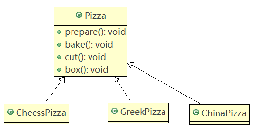
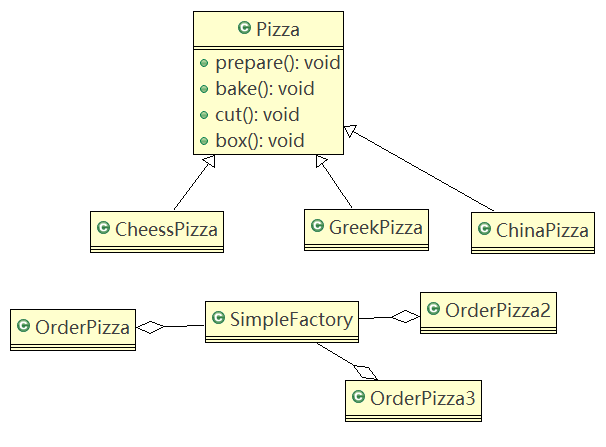
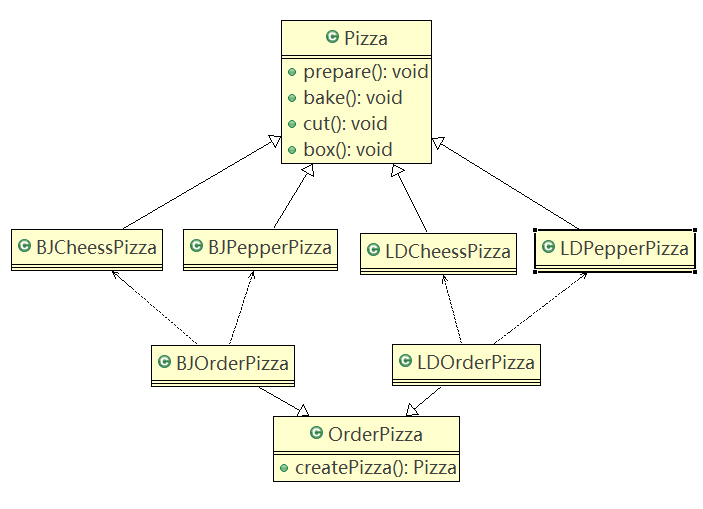
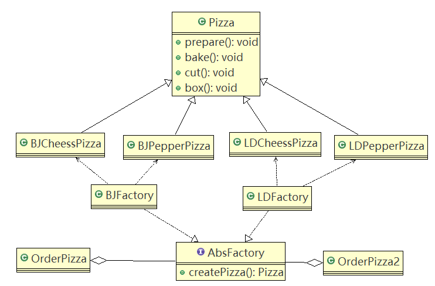

# 工厂模式

## 简单工厂模式

#### 问题引入

做披萨：要便于披萨种类的扩展，便于维护

1. 披萨的种类很多
2. 披萨的制作有prepare，bake，cut，box
3. 完成披萨店订购功能

##### 使用传统方式

思路分析（类图）



代码

```java
//将Pizza 类做成抽象
public abstract class Pizza {
	protected String name; //名字

	//准备原材料, 不同的披萨不一样，因此，我们做成抽象方法
	public abstract void prepare();

	public void bake() {
		System.out.println(name + " baking;");
	}

	public void cut() {
		System.out.println(name + " cutting;");
	}

	//打包
	public void box() {
		System.out.println(name + " boxing;");
	}

	public void setName(String name) {
		this.name = name;
	}
}

public class CheesePizza extends Pizza {

	@Override
	public void prepare() {
		// TODO Auto-generated method stub
		System.out.println(" 给制作奶酪披萨 准备原材料 ");
	}
}

public class GreekPizza extends Pizza {

	@Override
	public void prepare() {
		// TODO Auto-generated method stub
		System.out.println(" 给希腊披萨 准备原材料 ");
	}
}

public class CheesePizza extends Pizza {

	@Override
	public void prepare() {
		// TODO Auto-generated method stub
		System.out.println(" 给制作奶酪披萨 准备原材料 ");
	}
}

public class OrderPizza {

	// 构造器
	public OrderPizza() {
		Pizza pizza = null;
		String orderType; // 订购披萨的类型
		do {
			orderType = getType();
			if (orderType.equals("greek")) {
				pizza = new GreekPizza();
				pizza.setName(" 希腊披萨 ");
			} else if (orderType.equals("cheese")) {
				pizza = new CheesePizza();
				pizza.setName(" 奶酪披萨 ");
			} else if (orderType.equals("pepper")) {
				pizza = new PepperPizza();
				pizza.setName("胡椒披萨");
			} else {
				break;
			}
			//输出pizza 制作过程
			pizza.prepare();
			pizza.bake();
			pizza.cut();
			pizza.box();
			
		} while (true);
	}   
}

//相当于一个客户端，发出订购
public class PizzaStore {

	public static void main(String[] args) {
		new OrderPizza();
	}

}
```

##### 传统方式的优缺点

1. 优点：易于理解，操作简单

2. 缺点：违反了设计模式的开闭原则，即对扩展开放，对修改关闭。即当给类增加新功能的时候，尽量不修改代码，或者尽可能少修改代码。

3. 如：要增加一个Pizza的种类（Pepper披萨），需要修改OrderPizza类内的逻辑代码。

4. 改进思路分析

   分析：修改代码可以接受，但如果在其他地方也有创建Pizza的代码，就意味着，也需要修改，而创建Pizza的代码，往往有多处。

   思路：**把创建Pizza对象封装到一个类中，这样有新的Pizza种类时，只需要修改该类就行了**，其他有创建到Pizza对象的代码就不需要修改了 → 简单工厂模式

### 基本介绍

1. 简单工厂模式属于**创建型模式**，是工厂模式的一种。**简单工厂模式是由一个工厂对象决定创建出哪一种产品类的实例**。简单工厂模式是工厂模式家族中**最简单实用**的模式。
2. 简单工厂模式：定义了一个创建对象的类，有这个类来**封装实例化对象的行为**（代码）。
3. 使用场景：软件开发中，当用到大量的创建某种、某类或者某批对象时，可以使用工厂模式。

#### 使用简单工厂模式

简单工厂模式的设计方案（类图）：



简单工厂类代码

```java
//简单工厂类
public class SimpleFactory {

	//更加orderType 返回对应的Pizza 对象
	public Pizza createPizza(String orderType) {

		Pizza pizza = null;

		System.out.println("使用简单工厂模式");
		if (orderType.equals("greek")) {
			pizza = new GreekPizza();
			pizza.setName(" 希腊披萨 ");
		} else if (orderType.equals("cheese")) {
			pizza = new CheesePizza();
			pizza.setName(" 奶酪披萨 ");
		} else if (orderType.equals("pepper")) {
			pizza = new PepperPizza();
			pizza.setName("胡椒披萨");
		}
		
		return pizza;
	}
	
	//简单工厂模式 也叫 静态工厂模式 
	
	public static Pizza createPizza2(String orderType) {

		Pizza pizza = null;

		System.out.println("使用简单工厂模式2");
		if (orderType.equals("greek")) {
			pizza = new GreekPizza();
			pizza.setName(" 希腊披萨 ");
		} else if (orderType.equals("cheese")) {
			pizza = new CheesePizza();
			pizza.setName(" 奶酪披萨 ");
		} else if (orderType.equals("pepper")) {
			pizza = new PepperPizza();
			pizza.setName("胡椒披萨");
		}
		
		return pizza;
	}

}

public class OrderPizza {

	//定义一个简单工厂对象
	SimpleFactory simpleFactory;
	Pizza pizza = null;
	
	//构造器
	public OrderPizza(SimpleFactory simpleFactory) {
		setFactory(simpleFactory);
	}
	
	public void setFactory(SimpleFactory simpleFactory) {
		String orderType = ""; //用户输入的
		
		this.simpleFactory = simpleFactory; //设置简单工厂对象
		
		do {
			orderType = getType(); 
			pizza = this.simpleFactory.createPizza(orderType);
			
			//输出pizza
			if(pizza != null) { //订购成功
				pizza.prepare();
				pizza.bake();
				pizza.cut();
				pizza.box();
			} else {
				System.out.println(" 订购披萨失败 ");
				break;
			}
		}while(true);
	}
	
	// 写一个方法，可以获取客户希望订购的披萨种类
	private String getType() {
		try {
			BufferedReader strin = new BufferedReader(new InputStreamReader(System.in));
			System.out.println("input pizza 种类:");
			String str = strin.readLine();
			return str;
		} catch (IOException e) {
			e.printStackTrace();
			return "";
		}
	}
}

public class OrderPizza2 {

	Pizza pizza = null;
	String orderType = "";
	// 构造器
	public OrderPizza2() {
		
		do {
			orderType = getType();
			pizza = SimpleFactory.createPizza2(orderType);

			// 输出pizza
			if (pizza != null) { // 订购成功
				pizza.prepare();
				pizza.bake();
				pizza.cut();
				pizza.box();
			} else {
				System.out.println(" 订购披萨失败 ");
				break;
			}
		} while (true);
	}

	// 写一个方法，可以获取客户希望订购的披萨种类
	private String getType() {
		try {
			BufferedReader strin = new BufferedReader(new InputStreamReader(System.in));
			System.out.println("input pizza 种类:");
			String str = strin.readLine();
			return str;
		} catch (IOException e) {
			e.printStackTrace();
			return "";
		}
	}
}

//相当于一个客户端，发出订购
public class PizzaStore {

	public static void main(String[] args) {
		//new OrderPizza();
		
		//使用简单工厂模式
		//new OrderPizza(new SimpleFactory());
		//System.out.println("~~退出程序~~");
		
		new OrderPizza2();
	}

}
```

## 工厂方法模式

#### 问题引入

披萨新增需求：客户在点披萨时，可以点不同口味的披萨。

1. 思路一：

   使用简单工厂模式，创建不同的简单工厂类。但考虑到项目的规模，以及软件的可维护性、可扩展性并不是特别好。

2. 思路二：

   使用工厂方法模式

### 模式介绍

工厂方法模式：**定义了一个创建对象的抽象方法，由子类决定要实例化的类。**工厂方法模式将**对象的实例化推迟到子类**。

工厂方法模式使用（类图）：



工厂方法模式代码

```java
//将Pizza 类做成抽象
public abstract class Pizza {
	protected String name; //名字

	//准备原材料, 不同的披萨不一样，因此，我们做成抽象方法
	public abstract void prepare();

	
	public void bake() {
		System.out.println(name + " baking;");
	}

	public void cut() {
		System.out.println(name + " cutting;");
	}

	//打包
	public void box() {
		System.out.println(name + " boxing;");
	}

	public void setName(String name) {
		this.name = name;
	}
}

public class BJCheesePizza extends Pizza {

	@Override
	public void prepare() {
		setName("北京的奶酪pizza");
		System.out.println(" 北京的奶酪pizza 准备原材料");
	}

}

public class BJPepperPizza extends Pizza {
	@Override
	public void prepare() {
		setName("北京的胡椒pizza");
		System.out.println(" 北京的胡椒pizza 准备原材料");
	}
}

public class LDCheesePizza extends Pizza{

	@Override
	public void prepare() {
		setName("伦敦的奶酪pizza");
		System.out.println(" 伦敦的奶酪pizza 准备原材料");
	}
}

public class LDPepperPizza extends Pizza{
	@Override
	public void prepare() {
		setName("伦敦的胡椒pizza");
		System.out.println(" 伦敦的胡椒pizza 准备原材料");
	}
}

public abstract class OrderPizza {

	//定义一个抽象方法，createPizza , 让各个工厂子类自己实现
	abstract Pizza createPizza(String orderType);
	
	// 构造器
	public OrderPizza() {
		Pizza pizza = null;
		String orderType; // 订购披萨的类型
		do {
			orderType = getType();
			pizza = createPizza(orderType); //抽象方法，由工厂子类完成
			//输出pizza 制作过程
			pizza.prepare();
			pizza.bake();
			pizza.cut();
			pizza.box();
			
		} while (true);
	}

	// 写一个方法，可以获取客户希望订购的披萨种类
	private String getType() {
		try {
			BufferedReader strin = new BufferedReader(new InputStreamReader(System.in));
			System.out.println("input pizza 种类:");
			String str = strin.readLine();
			return str;
		} catch (IOException e) {
			e.printStackTrace();
			return "";
		}
	}

}

public class BJOrderPizza extends OrderPizza {

	@Override
	Pizza createPizza(String orderType) {
	
		Pizza pizza = null;
		if(orderType.equals("cheese")) {
			pizza = new BJCheesePizza();
		} else if (orderType.equals("pepper")) {
			pizza = new BJPepperPizza();
		}
		return pizza;
	}

}

public class LDOrderPizza extends OrderPizza {

	
	@Override
	Pizza createPizza(String orderType) {
	
		Pizza pizza = null;
		if(orderType.equals("cheese")) {
			pizza = new LDCheesePizza();
		} else if (orderType.equals("pepper")) {
			pizza = new LDPepperPizza();
		}
		return pizza;
	}

}

public class PizzaStore {

	public static void main(String[] args) {
		String loc = "bj";
		if (loc.equals("bj")) {
			//创建北京口味的各种Pizza
			new BJOrderPizza();
		} else {
			//创建伦敦口味的各种Pizza
			new LDOrderPizza();
		}
	}

}
```

## 抽象工厂模式

### 基本介绍

1. 抽象工厂模式：**定义了一个interface用于创建相关或有依赖关系的对象簇**，而无需指明具体的类。

2. 抽象工厂模式可以将简单工厂模式和工厂方法模式进行整合。

3. 从设计层面看，抽象工厂模式就是对简单工厂模式的改进（或者称为进一步的抽象）。

4. 将工厂抽象成**两层，AbsFactory（抽象工厂）和具体实现的工厂子类**。可以根据创建对象类型使用对应的工厂子类。将单个的简单工厂类变成了工厂簇，更利于代码的维护和扩展。

5. 类图

   

抽象工厂代码

```java
//一个抽象工厂模式的抽象层(接口)
public interface AbsFactory {
	//让下面的工厂子类来 具体实现
	public Pizza createPizza(String orderType);
}

//这是工厂子类
public class BJFactory implements AbsFactory {

	@Override
	public Pizza createPizza(String orderType) {
		System.out.println("~使用的是抽象工厂模式~");
		
		Pizza pizza = null;
		if(orderType.equals("cheese")) {
			pizza = new BJCheesePizza();
		} else if (orderType.equals("pepper")){
			pizza = new BJPepperPizza();
		}
		return pizza;
	}

}

public class LDFactory implements AbsFactory {

	@Override
	public Pizza createPizza(String orderType) {
		System.out.println("~使用的是抽象工厂模式~");
		Pizza pizza = null;
		if (orderType.equals("cheese")) {
			pizza = new LDCheesePizza();
		} else if (orderType.equals("pepper")) {
			pizza = new LDPepperPizza();
		}
		return pizza;
	}

}

public class OrderPizza {

	AbsFactory factory;

	// 构造器
	public OrderPizza(AbsFactory factory) {
		setFactory(factory);
	}

	private void setFactory(AbsFactory factory) {
		Pizza pizza = null;
		String orderType = ""; // 用户输入
		this.factory = factory;
		do {
			orderType = getType();
			// factory 可能是北京的工厂子类，也可能是伦敦的工厂子类
			pizza = factory.createPizza(orderType);
			if (pizza != null) { // 订购ok
				pizza.prepare();
				pizza.bake();
				pizza.cut();
				pizza.box();
			} else {
				System.out.println("订购失败");
				break;
			}
		} while (true);
	}

	// 写一个方法，可以获取客户希望订购的披萨种类
	private String getType() {
		try {
			BufferedReader strin = new BufferedReader(new InputStreamReader(System.in));
			System.out.println("input pizza 种类:");
			String str = strin.readLine();
			return str;
		} catch (IOException e) {
			e.printStackTrace();
			return "";
		}
	}
}

public class PizzaStore {

	public static void main(String[] args) {
		//new OrderPizza(new BJFactory());
		new OrderPizza(new LDFactory());
	}

}
```

## 工厂模式在JDK中应用源码分析

JDK中的Calendar类中，使用了简单工厂模式

源码：

```java
public class Factory {

	public static void main(String[] args) {
		// getInstance 是 Calendar 静态方法
		Calendar cal = Calendar.getInstance();
	    // 注意月份下标从0开始，所以取月份要+1
	    System.out.println("年:" + cal.get(Calendar.YEAR));
	    System.out.println("月:" + (cal.get(Calendar.MONTH) + 1));       
	    System.out.println("日:" + cal.get(Calendar.DAY_OF_MONTH));
	    System.out.println("时:" + cal.get(Calendar.HOUR_OF_DAY));
	    System.out.println("分:" + cal.get(Calendar.MINUTE));
	    System.out.println("秒:" + cal.get(Calendar.SECOND));   
	}

}
```

```java
/**
     * Gets a calendar using the default time zone and locale. The
     * <code>Calendar</code> returned is based on the current time
     * in the default time zone with the default
     * {@link Locale.Category#FORMAT FORMAT} locale.
     *
     * @return a Calendar.
     */
public static Calendar getInstance(){
    return createCalendar(TimeZone.getDefault(), Locale.getDefault(Locale.Category.FORMAT));
}
```

```java
private static Calendar createCalendar(TimeZone zone,
                                           Locale aLocale)
    {
        CalendarProvider provider =
            LocaleProviderAdapter.getAdapter(CalendarProvider.class, aLocale)
                                 .getCalendarProvider();
        if (provider != null) {
            try {
                return provider.getInstance(zone, aLocale);
            } catch (IllegalArgumentException iae) {
                // fall back to the default instantiation
            }
        }

        Calendar cal = null;

        if (aLocale.hasExtensions()) {
            String caltype = aLocale.getUnicodeLocaleType("ca");
            if (caltype != null) {
                switch (caltype) {
                case "buddhist":
                cal = new BuddhistCalendar(zone, aLocale);
                    break;
                case "japanese":
                    cal = new JapaneseImperialCalendar(zone, aLocale);
                    break;
                case "gregory":
                    cal = new GregorianCalendar(zone, aLocale);
                    break;
                }
            }
        }
        if (cal == null) {
            // If no known calendar type is explicitly specified,
            // perform the traditional way to create a Calendar:
            // create a BuddhistCalendar for th_TH locale,
            // a JapaneseImperialCalendar for ja_JP_JP locale, or
            // a GregorianCalendar for any other locales.
            // NOTE: The language, country and variant strings are interned.
            if (aLocale.getLanguage() == "th" && aLocale.getCountry() == "TH") {
                cal = new BuddhistCalendar(zone, aLocale);
            } else if (aLocale.getVariant() == "JP" && aLocale.getLanguage() == "ja"
                       && aLocale.getCountry() == "JP") {
                cal = new JapaneseImperialCalendar(zone, aLocale);
            } else {
                cal = new GregorianCalendar(zone, aLocale);
            }
        }
        return cal;
    }
```

## 工厂模式总结

1. 工厂模式的意义：

   将实例化对象的代码提取出来，放到一个类中同一管理和维护，达到和主项目的依赖关系的解耦。从而提高项目的扩展和维护性。

2. 三种工厂模式（简单工厂模式、工厂方法模式、抽象工厂模式）

3. 设计模式的依赖抽象原则

   - 创建对象时，不要直接new类，而是把这个new类的动作放在一个工厂的方法中，并返回。（也可以说变量不要直接持有具体类的引用）
   - 不要让类继承具体类，而是继承抽象类或者实现interface(接口)
   - 不要覆盖基类中已经实现的方法