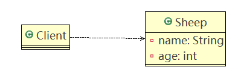
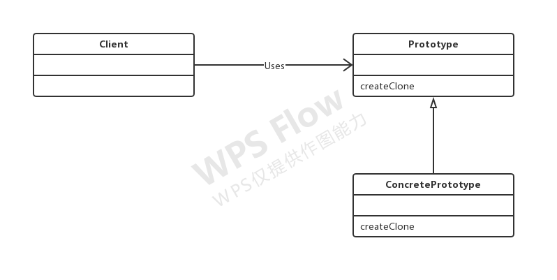

# 原型模式

#### 问题引入：克隆羊

现有一只羊，名字为：tom，年龄：1，颜色为：白色，请编写程序创建和tom羊属性完全相同的10只羊。

##### 传统方式

**类图**



**代码**

```java
public class Sheep {
	private String name;
	private int age;
	private String color;
	public Sheep(String name, int age, String color) {
		super();
		this.name = name;
		this.age = age;
		this.color = color;
	}
	public String getName() {
		return name;
	}
	public void setName(String name) {
		this.name = name;
	}
	public int getAge() {
		return age;
	}
	public void setAge(int age) {
		this.age = age;
	}
	public String getColor() {
		return color;
	}
	public void setColor(String color) {
		this.color = color;
	}
	@Override
	public String toString() {
		return "Sheep [name=" + name + ", age=" + age + ", color=" + color + "]";
	}	
}

public class Client {

	public static void main(String[] args) {
		// TODO Auto-generated method stub
		//传统的方法
		Sheep sheep = new Sheep("tom", 1, "白色");
		
		Sheep sheep2 = new Sheep(sheep.getName(), sheep.getAge(), sheep.getColor());
		Sheep sheep3 = new Sheep(sheep.getName(), sheep.getAge(), sheep.getColor());
		Sheep sheep4 = new Sheep(sheep.getName(), sheep.getAge(), sheep.getColor());
		Sheep sheep5 = new Sheep(sheep.getName(), sheep.getAge(), sheep.getColor());
		//....
		
		System.out.println(sheep);
		System.out.println(sheep2);
		System.out.println(sheep3);
		System.out.println(sheep4);
		System.out.println(sheep5);
		//...
	}
}
```

##### 传统方式的优缺点

1. 优点：易于理解，操作简单

2. 缺点：

   - 在创建新对象时，总是需要重新获取原始对象的属性，如果创建的对象比较复杂时，效率低。
   - 总是需要重新初始化对象，而不是动态地获得对象运行时的状态，不够灵活。

3. 改进思路：

   Java中Object类是所有类的根类，Object类提供了一个clone()方法，该方法可以将一个Java对象复制一份，但需要实现clone的Java类必须要实现一个接口Cloneable，该接口表示该类能够复制且具有复制的能力 → **原型模式**

## 原型模式的基本介绍

1. 原型模式（Prototype模式）是指：**用原型实例指定创建对象的种类，并且通过拷贝这些原型，创建新的对象**。
2. 原型模式是一种创建型设计模式，允许一个对象再创建另一个可定制的对象，无需知道如何创建的细节。
3. 工作原理：通过将一个原型对象传给那个要发动创建的对象，这个要发动创建的对象通过请求原型对象拷贝它自己来实施创建，即 **对象.clone()**

#### 原型模式原理结构图-uml类图



##### 原理结构图说明

1. Prototype：原型类，声明一个克隆自己的接口。
2. ConcretePrototype：具体的原型类，实现一个克隆自己的操作。
3. Client：让一个原型对象克隆自己，从而创建一个新的对象（属性一样）。

#### 代码示例

```java
public class Sheep implements Cloneable {
	private String name;
	private int age;
	private String color;
	private String address = "蒙古羊";
	public Sheep friend; //是对象, 克隆是会如何处理
	public Sheep(String name, int age, String color) {
		super();
		this.name = name;
		this.age = age;
		this.color = color;
	}
	public String getName() {
		return name;
	}
	public void setName(String name) {
		this.name = name;
	}
	public int getAge() {
		return age;
	}
	public void setAge(int age) {
		this.age = age;
	}
	public String getColor() {
		return color;
	}
	public void setColor(String color) {
		this.color = color;
	}
	
	@Override
	public String toString() {
		return "Sheep [name=" + name + ", age=" + age + ", color=" + color + ", address=" + address + "]";
	}
	//克隆该实例，使用默认的clone方法来完成
	@Override
	protected Object clone()  {
		
		Sheep sheep = null;
		try {
			sheep = (Sheep)super.clone();
		} catch (Exception e) {
			System.out.println(e.getMessage());
		}
		return sheep;
	}	
}

public class Client {

	public static void main(String[] args) {
		System.out.println("原型模式完成对象的创建");
		
		Sheep sheep = new Sheep("tom", 1, "白色");
		
		sheep.friend = new Sheep("jack", 2, "黑色");
		
		Sheep sheep2 = (Sheep)sheep.clone(); //克隆
		Sheep sheep3 = (Sheep)sheep.clone(); //克隆
		Sheep sheep4 = (Sheep)sheep.clone(); //克隆
		Sheep sheep5 = (Sheep)sheep.clone(); //克隆
		
		System.out.println("sheep2 =" + sheep2 + "sheep2.friend=" + sheep2.friend.hashCode());
		System.out.println("sheep3 =" + sheep3 + "sheep3.friend=" + sheep3.friend.hashCode());
		System.out.println("sheep4 =" + sheep4 + "sheep4.friend=" + sheep4.friend.hashCode());
		System.out.println("sheep5 =" + sheep5 + "sheep5.friend=" + sheep5.friend.hashCode());
	}

}
```

## Spring框架中使用原型模式的源码分析

Spring中原型bean的创建，就是原型模式的应用

测试代码：

Monster.java

```java
public class Monster {

	private Integer id = 10 ;
	private String nickname = "牛魔王";
	private String skill = "芭蕉扇";
	public Monster() {
		
		System.out.println("monster 创建..");
	}
	public Monster(Integer id, String nickname, String skill) {
		//System.out.println("Integer id, String nickname, String skill被调用");
		this.id = id;
		this.nickname = nickname;
		this.skill = skill;
	}
	
	public Monster( String nickname, String skill,Integer id) {
		
		this.id = id;
		this.nickname = nickname;
		this.skill = skill;
	}
	public Integer getId() {
		return id;
	}
	public void setId(Integer id) {
		this.id = id;
	}
	public String getNickname() {
		return nickname;
	}
	public void setNickname(String nickname) {
		this.nickname = nickname;
	}
	public String getSkill() {
		return skill;
	}
	public void setSkill(String skill) {
		this.skill = skill;
	}
	@Override
	public String toString() {
		return "Monster [id=" + id + ", nickname=" + nickname + ", skill="
				+ skill + "]";
	}	
}
```

beans.xml

```xml
<?xml version="1.0" encoding="UTF-8"?>
<beans xmlns="http://www.springframework.org/schema/beans"
	xmlns:xsi="http://www.w3.org/2001/XMLSchema-instance"
	xmlns:p="http://www.springframework.org/schema/p"
	xmlns:util="http://www.springframework.org/schema/util"
	xmlns:context="http://www.springframework.org/schema/context"
	xsi:schemaLocation="http://www.springframework.org/schema/beans http://www.springframework.org/schema/beans/spring-beans.xsd
		http://www.springframework.org/schema/util http://www.springframework.org/schema/util/spring-util-4.0.xsd
		http://www.springframework.org/schema/context http://www.springframework.org/schema/context/spring-context-4.0.xsd">


	<!-- 这里的 scope="prototype" 即 原型模式来创建 -->
	<bean id="id01" class="com.test.spring.bean.Monster"
		scope="prototype" />


</beans>
```

ProtoType.java

```java
public class ProtoType {

	public static void main(String[] args) {
		// TODO Auto-generated method stub
		ApplicationContext applicationContext = new ClassPathXmlApplicationContext("beans.xml");
		// 获取monster[通过id获取monster]
		Object bean = applicationContext.getBean("id01");
		System.out.println("bean" + bean); // 输出 "牛魔王" .....
		
		Object bean2 = applicationContext.getBean("id01");
		
		System.out.println("bean2" + bean2); //输出 "牛魔王" .....

		System.out.println(bean == bean2); // false
		
		// ConfigurableApplicationContext
	}

}
```

Spring 源码

AbstractApplicationContext.java

```java
@Override
	public Object getBean(String name) throws BeansException {
		assertBeanFactoryActive();
		return getBeanFactory().getBean(name);
	}
```

AbstractBeanFactory.java

```java
@Override
	public Object getBean(String name) throws BeansException {
		return doGetBean(name, null, null, false);
	}
```

```java
/**
	 * Return an instance, which may be shared or independent, of the specified bean.
	 * @param name the name of the bean to retrieve
	 * @param requiredType the required type of the bean to retrieve
	 * @param args arguments to use if creating a prototype using explicit arguments to a
	 * static factory method. It is invalid to use a non-null args value in any other case.
	 * @param typeCheckOnly whether the instance is obtained for a type check,
	 * not for actual use
	 * @return an instance of the bean
	 * @throws BeansException if the bean could not be created
	 */
	@SuppressWarnings("unchecked")
	protected <T> T doGetBean(
			final String name, final Class<T> requiredType, final Object[] args, boolean typeCheckOnly)
			throws BeansException {

		final String beanName = transformedBeanName(name);
		Object bean;

		// Eagerly check singleton cache for manually registered singletons.
		Object sharedInstance = getSingleton(beanName);
		if (sharedInstance != null && args == null) {
			if (logger.isDebugEnabled()) {
				if (isSingletonCurrentlyInCreation(beanName)) {
					logger.debug("Returning eagerly cached instance of singleton bean '" + beanName +
							"' that is not fully initialized yet - a consequence of a circular reference");
				}
				else {
					logger.debug("Returning cached instance of singleton bean '" + beanName + "'");
				}
			}
			bean = getObjectForBeanInstance(sharedInstance, name, beanName, null);
		}

		else {
			// Fail if we're already creating this bean instance:
			// We're assumably within a circular reference.
			if (isPrototypeCurrentlyInCreation(beanName)) {
				throw new BeanCurrentlyInCreationException(beanName);
			}

			// Check if bean definition exists in this factory.
			BeanFactory parentBeanFactory = getParentBeanFactory();
			if (parentBeanFactory != null && !containsBeanDefinition(beanName)) {
				// Not found -> check parent.
				String nameToLookup = originalBeanName(name);
				if (args != null) {
					// Delegation to parent with explicit args.
					return (T) parentBeanFactory.getBean(nameToLookup, args);
				}
				else {
					// No args -> delegate to standard getBean method.
					return parentBeanFactory.getBean(nameToLookup, requiredType);
				}
			}

			if (!typeCheckOnly) {
				markBeanAsCreated(beanName);
			}

			try {
				final RootBeanDefinition mbd = getMergedLocalBeanDefinition(beanName);
				checkMergedBeanDefinition(mbd, beanName, args);

				// Guarantee initialization of beans that the current bean depends on.
				String[] dependsOn = mbd.getDependsOn();
				if (dependsOn != null) {
					for (String dependsOnBean : dependsOn) {
						if (isDependent(beanName, dependsOnBean)) {
							throw new BeanCreationException("Circular depends-on relationship between '" +
									beanName + "' and '" + dependsOnBean + "'");
						}
						registerDependentBean(dependsOnBean, beanName);
						getBean(dependsOnBean);
					}
				}

				// Create bean instance.
				if (mbd.isSingleton()) {
					sharedInstance = getSingleton(beanName, new ObjectFactory<Object>() {
						@Override
						public Object getObject() throws BeansException {
							try {
								return createBean(beanName, mbd, args);
							}
							catch (BeansException ex) {
								// Explicitly remove instance from singleton cache: It might have been put there
								// eagerly by the creation process, to allow for circular reference resolution.
								// Also remove any beans that received a temporary reference to the bean.
								destroySingleton(beanName);
								throw ex;
							}
						}
					});
					bean = getObjectForBeanInstance(sharedInstance, name, beanName, mbd);
				}

				else if (mbd.isPrototype()) {
					// It's a prototype -> create a new instance.
					Object prototypeInstance = null;
					try {
						beforePrototypeCreation(beanName);
						prototypeInstance = createBean(beanName, mbd, args);
					}
					finally {
						afterPrototypeCreation(beanName);
					}
					bean = getObjectForBeanInstance(prototypeInstance, name, beanName, mbd);
				}

				else {
					String scopeName = mbd.getScope();
					final Scope scope = this.scopes.get(scopeName);
					if (scope == null) {
						throw new IllegalStateException("No Scope registered for scope '" + scopeName + "'");
					}
					try {
						Object scopedInstance = scope.get(beanName, new ObjectFactory<Object>() {
							@Override
							public Object getObject() throws BeansException {
								beforePrototypeCreation(beanName);
								try {
									return createBean(beanName, mbd, args);
								}
								finally {
									afterPrototypeCreation(beanName);
								}
							}
						});
						bean = getObjectForBeanInstance(scopedInstance, name, beanName, mbd);
					}
					catch (IllegalStateException ex) {
						throw new BeanCreationException(beanName,
								"Scope '" + scopeName + "' is not active for the current thread; " +
								"consider defining a scoped proxy for this bean if you intend to refer to it from a singleton",
								ex);
					}
				}
			}
			catch (BeansException ex) {
				cleanupAfterBeanCreationFailure(beanName);
				throw ex;
			}
		}

		// Check if required type matches the type of the actual bean instance.
		if (requiredType != null && bean != null && !requiredType.isAssignableFrom(bean.getClass())) {
			try {
				return getTypeConverter().convertIfNecessary(bean, requiredType);
			}
			catch (TypeMismatchException ex) {
				if (logger.isDebugEnabled()) {
					logger.debug("Failed to convert bean '" + name + "' to required type [" +
							ClassUtils.getQualifiedName(requiredType) + "]", ex);
				}
				throw new BeanNotOfRequiredTypeException(name, requiredType, bean.getClass());
			}
		}
		return (T) bean;
	}
```

## 浅拷贝和深拷贝

### 浅拷贝

1. 对于数据类型是基本数据类型的成员变量，浅拷贝会直接进行值传递，也就是将该属性值复制一份给新的对象。
2. 对于数据类型是引用数据类型的成员变量，如成员变量是某个数组、某个类的对象等，那么浅拷贝会进行引用传递，也就是只是将该成员变量的引用值（内存地址）复制一份给新的对象。因为实际上两个对象的该成员变量都指向同一个实例。在这种情况下，在一个对象中修改该成员变量会影响到另一个对象的该成员变量值。
3. 浅拷贝是使用默认的clone()方法来实现的。

### 深拷贝

1. 复制对象的所有基本数据类型的成员变量值。
2. 为所有引用数据类型的成员变量申请存储空间，并复制每个引用数据类型成员变量所引用的对象，直到该对象可达的所有对象。即：**对象进行深拷贝要对整个对象（包括对象的引用类型）进行拷贝。**
3. 深拷贝实现方式：
   - 重写clone方法
   - 通过**对象序列化**实现（推荐）

### 示例代码

```java
public class DeepCloneableTarget implements Serializable, Cloneable {
	
	private static final long serialVersionUID = 1L;

	private String cloneName;

	private String cloneClass;

	//构造器
	public DeepCloneableTarget(String cloneName, String cloneClass) {
		this.cloneName = cloneName;
		this.cloneClass = cloneClass;
	}

	//因为该类的属性，都是String , 因此我们这里使用默认的clone完成即可
	@Override
	protected Object clone() throws CloneNotSupportedException {
		return super.clone();
	}
}

//-----------------------------------------------------//

public class DeepProtoType implements Serializable, Cloneable{
	
	public String name; //String 属性
	public DeepCloneableTarget deepCloneableTarget;// 引用类型
	public DeepProtoType() {
		super();
	}
	
	//深拷贝 - 方式 1 使用clone 方法
	@Override
	protected Object clone() throws CloneNotSupportedException {
		
		Object deep = null;
		//这里完成对基本数据类型(属性)和String的克隆
		deep = super.clone(); 
		//对引用类型的属性，进行单独处理
		DeepProtoType deepProtoType = (DeepProtoType)deep;
		deepProtoType.deepCloneableTarget  = (DeepCloneableTarget)deepCloneableTarget.clone();
		
		return deepProtoType;
	}
	
	//深拷贝 - 方式2 通过对象的序列化实现 (推荐)
	public Object deepClone() {
		
		//创建流对象
		ByteArrayOutputStream bos = null;
		ObjectOutputStream oos = null;
		ByteArrayInputStream bis = null;
		ObjectInputStream ois = null;
		
		try {
			
			//序列化
			bos = new ByteArrayOutputStream();
			oos = new ObjectOutputStream(bos);
			oos.writeObject(this); //当前这个对象以对象流的方式输出
			
			//反序列化
			bis = new ByteArrayInputStream(bos.toByteArray());
			ois = new ObjectInputStream(bis);
			DeepProtoType copyObj = (DeepProtoType)ois.readObject();
			
			return copyObj;
			
		} catch (Exception e) {
			// TODO: handle exception
			e.printStackTrace();
			return null;
		} finally {
			//关闭流
			try {
				bos.close();
				oos.close();
				bis.close();
				ois.close();
			} catch (Exception e2) {
				System.out.println(e2.getMessage());
			}
		}
		
	}
}

//----------------------------------------------------//

public class Client {

	public static void main(String[] args) throws Exception {
		
		DeepProtoType p = new DeepProtoType();
		p.name = "宋江";
		p.deepCloneableTarget = new DeepCloneableTarget("大牛", "小牛");
		
		//方式1 完成深拷贝
		DeepProtoType p2 = (DeepProtoType) p.clone();
		
		System.out.println("p.name=" + p.name + "p.deepCloneableTarget=" + p.deepCloneableTarget.hashCode());
		System.out.println("p2.name=" + p.name + "p2.deepCloneableTarget=" + p2.deepCloneableTarget.hashCode());
	
		//方式2 完成深拷贝
		DeepProtoType p3 = (DeepProtoType) p.deepClone();
		
		System.out.println("p.name=" + p.name + "p.deepCloneableTarget=" + p.deepCloneableTarget.hashCode());
		System.out.println("p3.name=" + p3.name + "p3.deepCloneableTarget=" + p3.deepCloneableTarget.hashCode());
	
	}
}
```

## 注意事项和细节

1. 创建新的对象比较复杂时，可以**利用原型模式简化对象的创建过程，同时也能够提高效率。**
2. 不用重新初始化对象，而是**动态地获得对象运行时的状态。**
3. 如果原始对象发生变化（增加或者减少属性），其它克隆对象的也会发生相应的变化，无需修改代码。
4. 在实现深克隆的时候可能需要比较复杂的代码。
5. 缺点：需要为每一个类配备一个克隆方法，这对全新的类说不是很难，但对已有的类进行改造时，需要修改其源代码，违背了开闭原则。