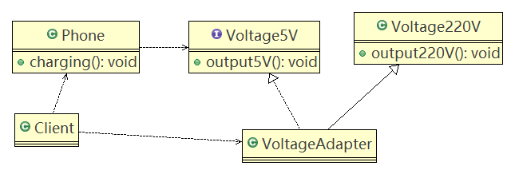
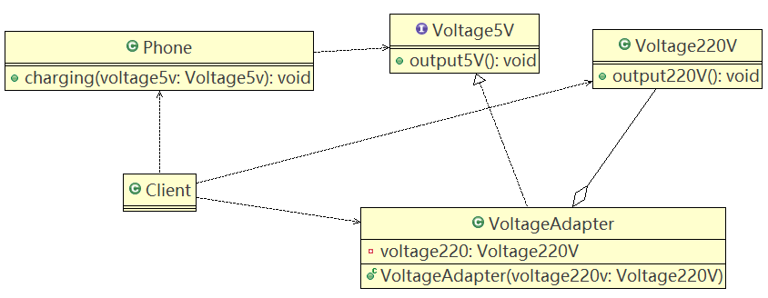
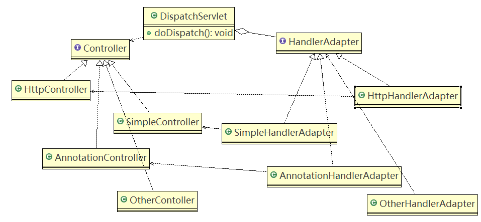

# 适配器模式

## 基本介绍

1. 适配器模式（Adapter Pattern）将某个类的接口转换成客户端期望的另一个接口表示，**主的目的是兼容性**，让原本因接口不匹配不能一起工作的两个类可以协同工作。其别名为包装器（Wrapper）
2. 适配器模式属于结构型模式
3. 主要分为三类：**类适配器模式、对象适配器模式、接口适配器模式**

## 工作原理

1. 适配器模式：将一个类的接口转换成另一种接口，让原本接口不兼容的类可以兼容
2. 从用户的角度看不到被适配者，是解耦的
3. 用户调用适配器转化出来的目标接口方法，适配器再调用被适配者的相关接口方法
4. 用户收到的反馈结果，感觉只是和目标接口交互

## 类适配器模式

### 介绍

基本介绍：Adapter类，通过继承src类，实现dst类接口，完成src → dst的适配

### 应用实例

#### 说明

以生活中充电器的例子来讲解适配器，充电器本身相当于Adapter，220V交流电相当于src（即被适配者），我们的目的dst（即：目标）是5V直流电。

#### 类图



#### **代码**

Client.java

```java
public class Client {

	public static void main(String[] args) {
		System.out.println(" === 类适配器模式 ====");
		Phone phone = new Phone();
		phone.charging(new VoltageAdapter());
	}

}
```

Phone.java

```java
public class Phone {

	//充电
	public void charging(IVoltage5V iVoltage5V) {
		if(iVoltage5V.output5V() == 5) {
			System.out.println("电压为5V, 可以充电~~");
		} else if (iVoltage5V.output5V() > 5) {
			System.out.println("电压大于5V, 不能充电~~");
		}
	}
}
```

IVoltage5V.java

```java
//适配接口
public interface IVoltage5V {
	public int output5V();
}
```

Voltage220V.java

```java
//被适配的类
public class Voltage220V {
	//输出220V的电压
	public int output220V() {
		int src = 220;
		System.out.println("电压=" + src + "伏");
		return src;
	}
}
```

VoltageAdapter.java

```java
//适配器类
public class VoltageAdapter extends Voltage220V implements IVoltage5V {

	@Override
	public int output5V() {
		// TODO Auto-generated method stub
		//获取到220V电压
		int srcV = output220V();
		int dstV = srcV / 44 ; //转成 5v
		return dstV;
	}

}
```

#### 注意事项和细节

1. Java是单继承机制，所以类适配器需要继承src类这一点算是一个缺点，因为这要求dst必须是接口，有一定局限性。
2. src类的方法在Adapter中都会暴露出来，也增加了使用的成本。
3. 由于其继承了src类，所以它可以根据需求重写src类的方法，使得Adapter的灵活性增强了。

## 对象适配器模式

### 介绍

1. 基本思路和类的适配器模式相同，只是将Adapter类作修改，不是继承src类，而是持有src类的实例，以解决兼容性的问题。即：持有src类，实现dst类接口，完成src → dst的适配。
2. 根据“**合成复用原则**”，在系统中尽量使用**关联关系（聚合）来替代继承关系**
3. 对象适配器模式是适配器模式常用的一种

### 应用实例

#### 说明

以生活中充电器的例子来讲解适配器，充电器本身相当于Adapter，220V交流电相当于src（即被适配者），我们的目的dst（即：目标）是5V直流电。

#### 类图



#### 代码

Client.java

```java
public class Client {

	public static void main(String[] args) {
		System.out.println(" === 对象适配器模式 ====");
		Phone phone = new Phone();
		phone.charging(new VoltageAdapter(new Voltage220V()));
	}

}
```

IVoltage5V.java

```java
//适配接口
public interface IVoltage5V {
	public int output5V();
}
```

Phone.java

```java
public class Phone {

	//充电
	public void charging(IVoltage5V iVoltage5V) {
		if(iVoltage5V.output5V() == 5) {
			System.out.println("电压为5V, 可以充电~~");
		} else if (iVoltage5V.output5V() > 5) {
			System.out.println("电压大于5V, 不能充电~~");
		}
	}
}
```

Voltage220V.java

```java
//被适配的类
public class Voltage220V {
	//输出220V的电压，不变
	public int output220V() {
		int src = 220;
		System.out.println("电压=" + src + "伏");
		return src;
	}
}
```

VoltageAdapter.java

```java
//适配器类
public class VoltageAdapter  implements IVoltage5V {

	private Voltage220V voltage220V; // 关联关系-聚合
	
	
	//通过构造器，传入一个 Voltage220V 实例
	public VoltageAdapter(Voltage220V voltage220v) {
		
		this.voltage220V = voltage220v;
	}


	@Override
	public int output5V() {
		
		int dst = 0;
		if(null != voltage220V) {
			int src = voltage220V.output220V();//获取220V 电压
			System.out.println("使用对象适配器，进行适配~~");
			dst = src / 44;
			System.out.println("适配完成，输出的电压为=" + dst);
		}
		
		return dst;
		
	}

}
```

#### 注意事项和细节

1. 对象适配器和类适配器其实算是同一种思想，只不过实现方式不同。

   根据合成复用原则，使用组合替代继承，所以它解决了类适配器必须继承src的局限性问题，也不再要求dst必须是接口。

2. 使用成本更低，更灵活。

## 接口适配器模式

### 介绍

1. 一些书籍称为：适配器模式（Default Adapter Pattern）或**缺省适配器模式**。
2. 核心思路：**当不需要全部实现接口提供的方法时，** **可以设计一个抽象类实现接口**，并为该接口中每个方法提供一个**默认实现（空方法）**，那么该**抽象类的子类可有选择地覆盖父类的某些方法**来实现需求。
3. 适用于一个接口不想使用其所有的方法的情况。

### 应用实例

1. Android中的属性动画ValueAnimator类可以通过addListener(AnimatorListener listener)方法添加监听器，常规写法：

   ```java
   ValueAnimator valueAnimator = ValueAnimator.ofInt(0,100);
   valueAnimator.addListener(new Animator.AnimatorListener() {
       @Override
       public void onAnimationStart(Animator animation) {
       }
       @Override
       public void onAnimationEnd(Animator animation) {
       }
       @Override
       public void onAnimationCancel(Animator animation) {
       }
       @Override
       public void onAnimationRepeat(Animator animation) {
       }
   });
   valueAnimator.start();
   ```

2. 如不想实现Animator.AnimatorListener接口的全部方法，只想监听onAnimationStart，如：

   ```java
   ValueAnimator valueAnimator = ValueAnimator.ofInt(0,100);
   valueAnimator.addListener(new AnimatorListenerAdapter() {
       @Override
       public void onAnimationStart(Animator animation) {
       //xxxx具体实现
       }
   });
   valueAnimator.start();
   ```

3. AnimatorListenerAdapter类，就是一个接口适配器，它实现了Animator.AnimatorListener类的所有方法。

   代码：

   ```java
   public abstract class AnimatorListenerAdapter implements Animator.AnimatorListener,Animator.AnimatorPauseListener {
       @Override //默认实现
       public void onAnimationCancel(Animator animation) {
       }
       @Override
       public void onAnimationEnd(Animator animation) {
       }
       @Override
       public void onAnimationRepeat(Animator animation) {
       }
       @Override
       public void onAnimationStart(Animator animation) {
       }
       @Override
       public void onAnimationPause(Animator animation) {
       }
       @Override
       public void onAnimationResume(Animator animation) {
       }
   }
   ```

4. AnimatorListener是一个接口

   ```java
   public static interface AnimatorListener {
       void onAnimationStart(Animator animation);
       void onAnimationEnd(Animator animation);
       void onAnimationCancel(Animator animation);
       void onAnimationRepeat(Animator animation);
   }
   ```

5. 程序里的匿名内部类就是Listener具体实现类

   ```java
   new AnimatorListenerAdapter() {
       @Override
       public void onAnimationStart(Animator animation) {
       //xxxx具体实现
       }
   }
   ```

6. 案例说明

   - 类图

     

   - 代码

     ```java
     public class Client {
     	public static void main(String[] args) {
     		
     		AbsAdapter absAdapter = new AbsAdapter() {
     			//只需要去覆盖我们 需要使用 接口方法
     			@Override
     			public void m1() {
     				// TODO Auto-generated method stub
     				System.out.println("使用了m1的方法");
     			}
     		};
     		
     		absAdapter.m1();
     	}
     }
     ```

     ```java
     public interface Interface4 {
     	public void m1();
     	public void m2();
     	public void m3();
     	public void m4();
     }
     ```

     ```java
     //在AbsAdapter 我们将 Interface4 的方法进行默认实现
     public abstract class AbsAdapter implements Interface4 {
     
     	//默认实现
     	public void m1() {
     
     	}
     
     	public void m2() {
     
     	}
     
     	public void m3() {
     
     	}
     
     	public void m4() {
     
     	}
     }
     ```

## SpringMVC框架中使用适配器模式的源码剖析

1. SpringMVC中的HandlerAdapter，使用了适配器模式。

2. SpringMVC处理请求的流程

   相关博客：https://www.jianshu.com/p/6f841d81ed72

   

   

3. 使用HandlerAdapter的原因分析：

   可以看到处理器的类型不同，有多重实现方式，那么调用方式就不是确定的，如果需要直接调用Controller方法，需要调用的时候就得不断是使用if else来进行判断是哪一种子类然后执行。那么如果要扩展Controller，就得修改原来的代码，这样违背了OCP原则。

手动写SpringMVC通过适配器设计模式获取到对应的Controller的源码

- Spring定义了一个适配接口，使得每一种Controller有一种对应的适配器实现类
- 适配器代替controller执行相应的方法
- 扩展Controller时，只需要增加一个适配器类就完成了SpringMVC的扩展了。



```java
//多种Controller实现  
public interface Controller {

}

class HttpController implements Controller {
	public void doHttpHandler() {
		System.out.println("http...");
	}
}

class SimpleController implements Controller {
	public void doSimplerHandler() {
		System.out.println("simple...");
	}
}

class AnnotationController implements Controller {
	public void doAnnotationHandler() {
		System.out.println("annotation...");
	}
}
```

```java
public class DispatchServlet {

	public static List<HandlerAdapter> handlerAdapters = new ArrayList<HandlerAdapter>();

	public DispatchServlet() {
		handlerAdapters.add(new AnnotationHandlerAdapter());
		handlerAdapters.add(new HttpHandlerAdapter());
		handlerAdapters.add(new SimpleHandlerAdapter());
	}

	public void doDispatch() {

		// 此处模拟SpringMVC从request取handler的对象，
		// 适配器可以获取到希望的Controller
		 HttpController controller = new HttpController();
		// AnnotationController controller = new AnnotationController();
		//SimpleController controller = new SimpleController();
		// 得到对应适配器
		HandlerAdapter adapter = getHandler(controller);
		// 通过适配器执行对应的controller对应方法
		adapter.handle(controller);

	}

	public HandlerAdapter getHandler(Controller controller) {
		//遍历：根据得到的controller(handler), 返回对应适配器
		for (HandlerAdapter adapter : this.handlerAdapters) {
			if (adapter.supports(controller)) {
				return adapter;
			}
		}
		return null;
	}

	public static void main(String[] args) {
		new DispatchServlet().doDispatch(); // http...
	}

}
```

```java
//定义一个Adapter接口 
public interface HandlerAdapter {
	public boolean supports(Object handler);

	public void handle(Object handler);
}

// 多种适配器类

class SimpleHandlerAdapter implements HandlerAdapter {

	public void handle(Object handler) {
		((SimpleController) handler).doSimplerHandler();
	}

	public boolean supports(Object handler) {
		return (handler instanceof SimpleController);
	}

}

class HttpHandlerAdapter implements HandlerAdapter {

	public void handle(Object handler) {
		((HttpController) handler).doHttpHandler();
	}

	public boolean supports(Object handler) {
		return (handler instanceof HttpController);
	}

}

class AnnotationHandlerAdapter implements HandlerAdapter {

	public void handle(Object handler) {
		((AnnotationController) handler).doAnnotationHandler();
	}

	public boolean supports(Object handler) {

		return (handler instanceof AnnotationController);
	}

}
```

## 适配器模式的注意事项和细节

1. 三种命名方式，是根据src是以怎样的形式给到Adapter（在Adapter里的形式）来命名的。

2. 类适配器：以类给到，在Adapter里，就是将src当做类，继承

   对象适配器：以对象给到，在Adapter里，将src作为一个对象，持有

   接口适配器：以接口给到，在Adapter里，将src作为一个接口，实现

3. Adapter模式最大的作用还是将原本不兼容的接口融合在一起工作

4. 实际开发中，实现应不拘泥上面的三种经典形式。